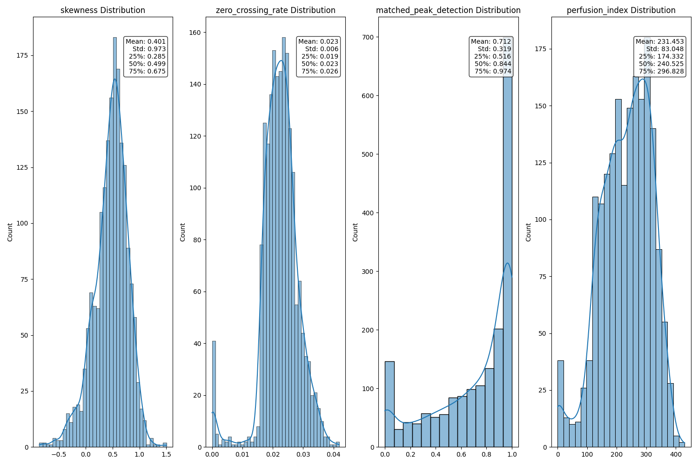
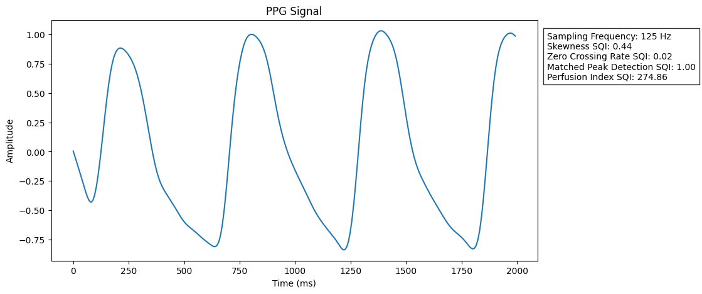
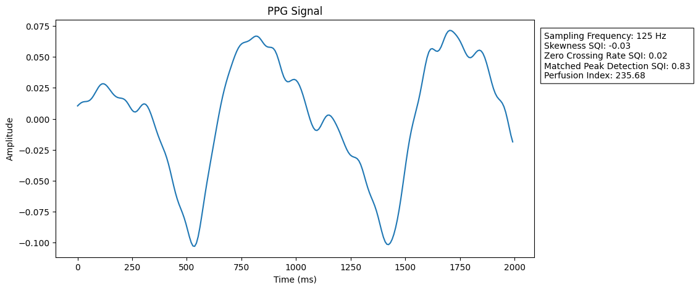
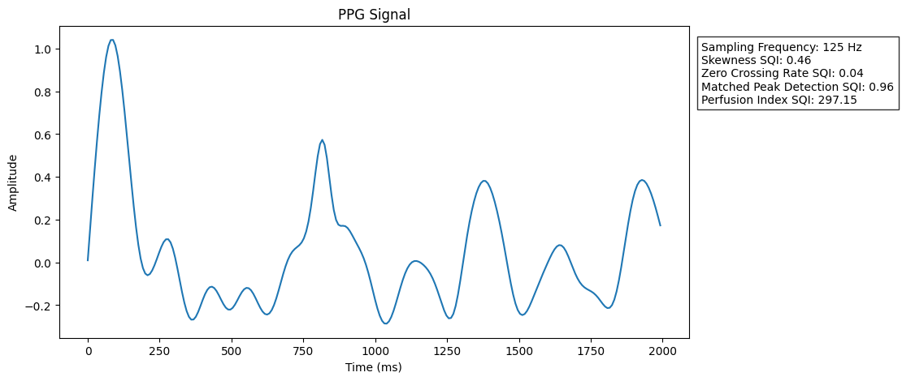
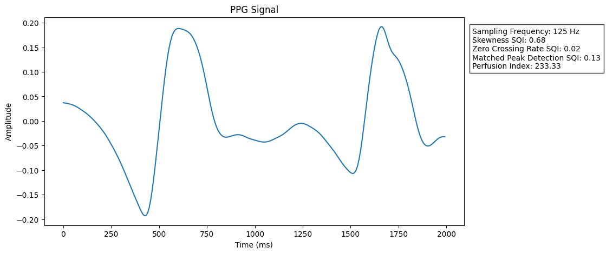
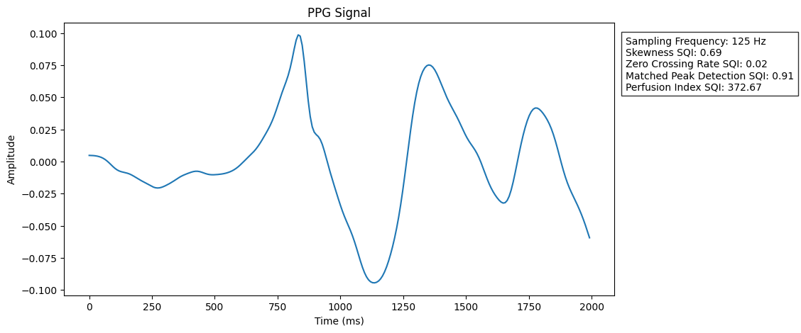

# Bhanu - Non-invasive Parkinson's Disease Detection Using Deep Learning Based Analysis of Photoplethysmography Signals

## Abstract

This research project investigates the potential of photoplethysmography (PPG) signals as non-invasive biomarkers for Parkinson's Disease (PD) detection. The project leverages the MIMIC-III waveform and clinical databases to investigate the feasibility of using deep learning models for analyzing physiological time series data in neurological disease detection.

## Research Objectives

1. Evaluate the efficacy of PPG signals as biomarkers for Parkinson's Disease
2. Develop and validate a deep learning approach for medical time series classification
3. Implement a systematic approach for processing MIMIC-III waveform data, including data loading, patient matching, and signal preprocessing pipelines

## Methodology

### Data Collection and Preprocessing

The study utilizes the MIMIC-III (Medical Information Mart for Intensive Care III) database, which comprises deidentified health data from over forty thousand patients who stayed in critical care units of the Beth Israel Deaconess Medical Center between 2001 and 2012.

1. Patient Cohort Selection:
   - Identification of PD patients using ICD-9 codes
   - Demographic matching of control subjects based on age and gender

2. Signal Preprocessing:
   - Extraction of PPG segments from waveform data
   - Bandpass filtering with a 4th-order Chebyshev 2 filter (0.5 Hz - 10 Hz)
   - Removal of segments with missing or NaN values

3. Signal Quality Assessment:
   - Implementation of comprehensive quality filtering using multiple indices:
      - Skewness
      - Zero crossings rate
      - Matched peak detection
      - Perfusion index

4. Data Transformation:
   - Signal standardization (zero mean, unit variance)
   - Creation of Hilbert-Huang Transform spectrograms
   - Resizing to 224x224 for model input
   - 70%/20%/10% Train/test/validation split at patient-level

### Quality Analysis Plots

The following plots demonstrate the signal quality assessment process:


*Distribution of quality indices for PPG signals across the entire dataset*

#### Example PPG Signals


*Example of a high-quality PPG signal meeting all quality thresholds*


*Example of a PPG signal violating only the skewness threshold*


*Example of a PPG signal violating only the zero crossings rate threshold*


*Example of a PPG signal violating only the matched peak detection threshold*


*Example of a PPG signal violating only the perfusion index threshold*

### Model Architecture

The model uses a CNN-based architecture (Bhanu):

- Input Layer: 1-channel 224x224 grayscale spectrograms
- Feature Extraction:
  - Three convolutional blocks with GELU activation
  - Max pooling and batch normalization
  - Adaptive average pooling
- Classification Head:
  - Dropout layer
  - Single linear layer for binary classification

Training Details:

- Loss Function: BCE with Logits Loss (weighted for class imbalance)
- Optimizer: AdamW with weight decay
- Learning Rate: 1e-5 with linear warmup and decay schedule
- Gradient Clipping: 1.0 threshold
- Early Stopping: Based on validation AUC-ROC

## Installation

### Prerequisites

- Valid PhysioNet credentials
- MIMIC-III data use agreement
- Completed CITI training
- Python 3.10+

### Setup

1. Clone the repository:

   ```bash
   git clone https://github.com/degenfabian/Bhanu.git
   cd Bhanu
   ```

2. Install dependencies:

   ```bash
   pip install -r requirements.txt
   ```

3. Download MIMIC-III data:

   ```bash
   python download_data.py
   ```

4. Preprocess data:

   ```bash
   python preprocess_data.py
   ```

5. Train and evaluate model:

   ```bash
   python train_and_eval.py
   ```

### Project Structure

```bash
Bhanu/
├── data/
│   ├── waveform_data/
│   │   ├── PD/
│   │   └── non_PD/
│   ├── quality_metrics.pt
│   ├── train_dataset.pt
│   ├── val_dataset.pt
│   └── test_dataset.pt
├── model_weights/
│   └── Bhanu.pt
├── plots/
│   ├── high_quality_ppg.png
│   ├── matched_peak_detection_low_quality_ppg.png
│   ├── perfusion_index_low_quality_ppg.png
│   ├── quality_metrics_distribution.png
│   ├── skewness_low_quality_ppg.png
│   └── zero_crossing_rate_low_quality_ppg.png
├── .gitignore
├── CITATION.cff
├── download_data.py
├── LICENSE
├── metrics.py
├── model.py
├── ppg_utils.py
├── preprocess_data.py
├── README.md
├── requirements.txt
└── train_and_eval.py
```

## Results and Discussion

*Note: So far I have not been able to produce results that are significantly better than random guessing. I will continue trying
different architectures and hyperparameters and publish the results here once they are satisfying.*

### Performance Metrics

The model will be evaluated using:

- AUC-ROC
- Accuracy
- Sensitivity
- Specificity
- F1 Score

## Limitations and Biases

1. Selection Bias
   - MIMIC-III data comes exclusively from ICU/hospital settings, meaning all subjects (both PD and control) were ill enough to require hospitalization
   - PD patients in the dataset may represent more severe cases than the general PD population or have additional diseases
   - Control subjects are not healthy individuals, potentially confounding the analysis

2. Demographic Biases
   - MIMIC-III data comes from a single medical center (Beth Israel Deaconess Medical Center)
   - Geographic limitation to one region may not represent global population variations
   - Potential socioeconomic biases based on hospital location and accessibility

## Future Work

- Validation studies with different datasets
- Prospective clinical validation
- Interpretability of model predictions
- Classification of different PD stages

## Contact

Maintainer: [Fabian Degen] - [fabidegen@gmail.com]

For bugs and feature requests, please open an issue in this GitHub repository.

## License

This project is licensed under the MIT License - see the [LICENSE](LICENSE) file for details.

---

**Research Disclaimer**: This work is intended for research purposes only. The methods and findings presented here should not be used for clinical diagnosis without proper validation and regulatory approval.

## References

```apa
Johnson, A., Pollard, T., & Mark, R. (2016). 
MIMIC-III Clinical Database (version 1.4). 
PhysioNet. https://doi.org/10.13026/C2XW26.

Moody, B., Moody, G., Villarroel, M., Clifford, G. D., & Silva, I. (2020).
MIMIC-III Waveform Database (version 1.0).
PhysioNet. https://doi.org/10.13026/c2607m.

Johnson, A., Pollard, T., Shen, L. et al.
MIMIC-III, a freely accessible critical care database.
Sci Data 3, 160035 (2016).
https://doi.org/10.1038/sdata.2016.35

Goldberger, A., Amaral, L., Glass, L., Hausdorff, J., Ivanov, P. C., Mark, R., ... & Stanley, H. E. (2000).
PhysioBank, PhysioToolkit, and PhysioNet: Components of a new research resource for complex physiologic signals.
Circulation [Online]. 101 (23), pp. e215–e220.

Elgendi M. (2016).
Optimal Signal Quality Index for Photoplethysmogram Signals.
Bioengineering (Basel, Switzerland), 3(4), 21.
https://doi.org/10.3390/bioengineering3040021

Li, B. N., Dong, M. C., & Vai, M. I. (2010).
On an automatic delineator for arterial blood pressure waveforms.
Biomedical Signal Processing and Control, 5(1), 76–81.
doi:10.1016/j.bspc.2009.06.002

Andrew J. Quinn, Vitor Lopes-dos-Santos, David Dupret, Anna Christina Nobre & Mark W. Woolrich (2021)
EMD: Empirical Mode Decomposition and Hilbert-Huang Spectral Analyses in Python
Journal of Open Source Software 10.21105/joss.02977

Le, V.-K. D., Ho, H. B., Karolcik, S., Hernandez, B., Greeff, H., Nguyen, V. H., … 
The Vietnam Icu Translational Applications Laboratory (vital) Investigators. (2022). 
vital_sqi: A Python package for physiological signal quality control. Frontiers in Physiology, 13. 
doi:10.3389/fphys.2022.1020458
```
